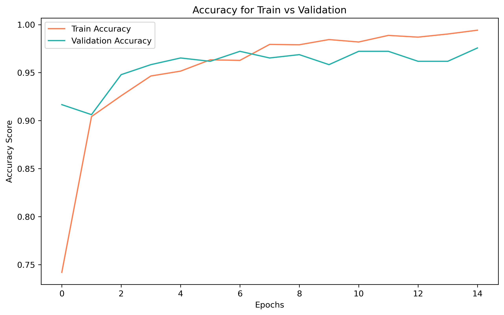

## Multiclass Classification of Covid-19, Viral Pneumonia, and Normal Presenting Chest X-Rays

This project was released on 2/10/2021, so the statistics represented below might be outdated. 

<b>The model produced in this project is not to be used as a diagnostic tool.</b>

### Table of Contents
Below is a table of contents, which contains the file name, file order, and file description. The file order column represents which order the files should be opened and read. File Order 1 should be started with. 

|File Name|File Order||File Description|
|---------|----------||----------------|
|README.md|1| The README file contains the executive summary and overview of the project as a whole.  |
|COVID-19 Radiography Database|2| File directory contains all of the images used during model training.  | 
|cnn-modeling_v2.ipynb|3| The cnn-modeling.ipynb contains all iterations of convolutional neural net models trained.  |
|powerpoint-presentation.pdf|4| A pdf containing the powerpoint slides our team used during project presentations.  |
|model-visualizations|5| A directory containing two images on accuracy and recall scores from the final production model.  |

#### The Problem
The world at large is currently in the midst of one of the largest healthcare crises since the 1918 Spanish flu. At the release of this project, hospitals, both rural and urban, all over the United States are undergoing extreme stress due to Covid-19 hospitalizations.  A [dataset](https://healthdata.gov/dataset/covid-19-reported-patient-impact-and-hospital-capacity-facility) recently released by the federal government of the United States contains the capacity reports for 2,200 counties nationwide. According to this data, 126 of the 2,200 counties have average hospital capacities above 90%. 

As hospitalizations for Covid-19 continue to occur at the current rate, it is paramount that rapid and accurate Covid-19 testing on patients with respiratory illness is occurring. Our team strove to discover if there was a fast and reliable way to identify Covid-19 infection in hospitalized patients using chest X-rays and deep learning techniques.  

#### The Solution
To the benefit of modern medicine, X-ray or Radiography was developed in 1985 by mechanical engineer and physicist Wilhelm Roentgen. An X-ray is a diagnostic tool, which uses ionized radiation to take pictures of body structures. The varying densities of body tissues and bones will absorb and/or block radiation as it passes through. A sensor, situated on the other side of the body, will capture the incoming radiation and present an image. The denser portions of the body show up on the X-ray as white areas, while less dense portions will appear darker. 

Also to our benefit, Covid-19 pneumonia can present as an atypical form of viral pneumonia; in contrast with typical viral pneumonia. The presenting symptoms of atypical vs typical pneumonia are readily visible on chest radiography and can be distinctive, which allows radiologists to help diagnose patients with respiratory disease. 

Our esteemed team focused on the classification of 3 classes of chest radiography: Covid-19 Pneumonia, Viral Pneumonia, and Normal. Harnessing the predictive power of a convolutional neural network (CNN), an artificial intelligence algorithm, we produced a multi-class classification model to help radiologists diagnose if a patient is presenting with Covid-19 pneumonia, viral pneumonia, or normal status.

#### Evaluation Metrics
Our team of learned data scientists applied domain knowledge to both the fields of artificial intelligence and medicine to obtain a classifier which performed above the null model in both accuracy and recall in predicitve power. The null model, a starting point to compare the performance of future models to, predicts the most frequently occuring class in the training data. The most frequently occuring class, Viral Pneumonia, would grant the null model 34.6% accuracy. 

The final production model was the CNN which scored the best on a pair of evaulation metrics: accuracy and recall. Accuracy is an important metric for the classifier because the CNN model should be able to classify with high predictive power all classes. In a diagnostic setting, probability is the name of the game and therefore you want accuracy on a diagnostic-helper to score as high as possible. 

The optimization of recall was also important, since we are trying to model towards correct classifications of diagnoses, the team felt a diagnostic-helper CNN model required a high true postitive rate - as Covid-19 and viral pneumonia are contagious diseases and curable with timely and accurate treatment. False negative classifications would be extremely harmful, as patients with a contagious pathogen could spread it unknowingly and not be getting the treatment they require.

#### Data Acquisition and Preprocessing
The dataset of anterior-posterior and posterior-anterior chest x-rays was obtained from [Kaggle](https://www.kaggle.com/tawsifurrahman/covid19-radiography-database)1. After downloading the data, it was read in using Kera's ImageDataGenerator. ImageDataGenerator was used in our model for the ease of use with data augumentation and image preprocessing. Due to the small dataset, approximately 1,200 images in each class, we used data augmentation in order to avoid model overfitting and to create more images from the training dataset. Data augmentation can make models robust to changes in size, illumination, etc. as they are trained on manipulated images.

Each image in the testing, validation, and testing dataset was rescaled and standardized to get pixel values between [0,1]. Below is an example of the radiography our team was using in the convolution neural network modeling. This image is an anterior-posterior chest x-ray from the Normal class. In this chest x-ray, the extending branches of the bronchi of the lungs are clearly seen and without ground glass or consolidation presentation has been classified as medical professionals as normal. 

#### Final Production Model
The final production model consisted of the following neural network architecture: data augmentation of the training data, a convolutional layer for edge detection, and a single hidden layer of 300 nodes.The output layer activation was 'softmax', therefore the class prediction is based on the highest probability in a vector containing probability values for each of the three classes. The final model scored approximately 93.5% on both accuracy and recall. This model was chosen as the final because it produced the highest pair-wise scores on both accuracy and recall.

The visualization below shows how the accuracy of the training data and validation data changed as the CNN model was trained over 15 epochs. As the CNN model continued to train over each epoch, we can see that the training accuracy continued to go increase - as the model became more and more specifically trained to that set of data. The validation accuracy, however, plateaued at around 95% accuracy. 

The next visualization, shown below, graphs how the recall score of both the training and validation data changed over the 15 epoch training period. Similarly to the accuracy graph above, the training recall continued to climb, as the CNN model became more trained on that set of data. Also similarly, the recall score of the validation data plateaued, in almost the exact same pattern as accuracy, at a 95% recall score.  

#### The Conclusion
Our venture to create a classifier which performed above the null model was successful. The final production model was successfuly classifying the Covid-19 pneumonia, viral pneumonia, and normal classes. Our team culminates everything we have learned into this statement: while not to be used as the sole diagnostic tool, a powerful predictor, such as a CNN, can be used to add additional confidence to diagnoses made by radiologists and guide radiological thinking. 

#### Recommendations
Our CNN model will have notable trouble accurately classifying patients depending on the presentation of the illness. A normal chest x-ray does not exclude Covid-19 pneumonia, as Covid-19 pneumonia may not actually be visible on radiographs. The observed ground glass pattern indicating infection occurs in both atypical and typical pneumonia and may present differently in individual patients, which could cause misclassification between the typical and atypical pneumonia classes. Taking these into consideration, the model is only be viable for patients with serious presentations of respiratory symptoms. 

#### Improvements
Though the model showed strong predictive power, there are improvements to note going forward. The size of the dataset was small, which has potentially hindered the generalibility of the model and it will be highly beneficial to continue to improve model performance with more data. Although we obtained a strong predicitive model, there are many other iterations to be explored within the convolutional neural network realm. 

#### Citations & Sources
1. M.E.H. Chowdhury, T. Rahman, A. Khandakar, R. Mazhar, M.A. Kadir, Z.B. Mahbub, K.R. Islam, M.S. Khan, A. Iqbal, N. Al-Emadi, M.B.I. Reaz, M. T. Islam, “Can AI help in screening Viral and COVID-19 pneumonia?” IEEE Access, Vol. 8, 2020, pp. 132665 - 132676.